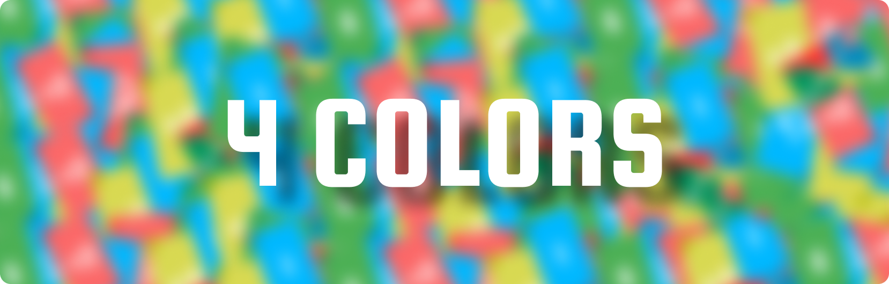

<a href="#">

The project is divided as follows:

* `applab/applab.js` - This file contains the applab library, which has all the
  javascript that applab uses to run the app. 

* `applab/applab.css` - This file contains some default CSS styling for the app.

* `index.html` - The primary HTML file, it contains all the buttons, text inputs, and other controls for
  the app.

* `style.css` - This file defines the custom styling for each control in the
  app. It contains all the colors, positions, dimensions, and other properties of the app's controls.

* `code.js` - This Javascript file has all the code that makes the app function.

* `assets` - This is a directory with all the asset files - pictures and sounds.

* `images` - contains imagery for strict github showcase (not used in software) 

# Installation

# Regarding AP Exam Terms and Conditions

This project was untilized as a submission for a College Board class *(AP Computer Science Principles)*
* **<ins>As per exam rules follow on Discussing Exam Questions:</ins>** *free-response content that is not released on the College Board website 2 days after the regularly scheduled exam administration* is **NOT** allowed, **HOWEVER** *If the free-response content on your AP Exam is posted to the College Board website two days after the regularly scheduled exam, you may discuss it at that point.* This serves true to the AP Computer Science 2023 Exam, with publically posted Student Samples including the questions.
* **This public github repository is <ins>NOT</ins> being shared to deliberately gain or attempt to gain, or to share an unfair advantage on any College Board test, nor is it threatening the integrity of the test itself.**

   The files contained in this project are <ins>licensed under a BSD 3-Clause</ins> stating that any redistribution <ins>**MUST**</ins> retain the copyright notice <ins>**AND**</ins> that any redistributions, in whole or in part, of the software, shall not be permitted for the use of an AP College Class Submission or the Digital Portfolio (collegeboard.org). 

The software, artistic works, and computer code are all protected under my Creative IP, and are not owned by College Board. 

# 

For a detailed view on the application, or to use my work as an APCSP Student Sample Reference, feel free to checkout my Exam Written Responses <a href="https://github.com/Ninja-Talon/4-Colors/blob/main/images/writtenResponses.pdf">**here**</a>!
